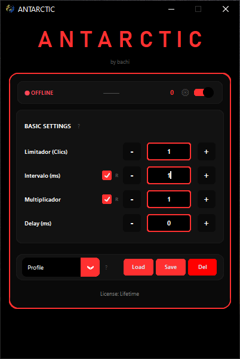

# Antarctic Autoclicker



Advanced autoclicker system with license management, latency compensation, and sophisticated timing algorithms. Built with Python and deployed on Vercel.

## Overview

Antarctic is a professional-grade autoclicker featuring real-time license validation, advanced latency compensation for online games, and multiple timing profiles including Markov chains, Gaussian distribution, and acceleration patterns. The system includes a complete backend API, admin panel, and public website.

## Key Features

- **Advanced Click System**: Single, double, and triple click modes with configurable timing
- **Latency Compensation**: Real-time RTT measurement and automatic timing adjustment for online games
- **Timing Algorithms**: 
  - Markov Chain: Realistic human-like patterns
  - Gaussian Distribution: Natural variation around target interval
  - Acceleration: Progressive speed increase
  - Perfect Machine: Zero-variance mathematical precision
- **License Management**: Online validation system with Supabase backend
- **Profile System**: Save and load multiple configurations
- **Security**: PyArmor obfuscation, anti-debugging, HWID binding
- **Modern GUI**: Built with CustomTkinter

## Technology Stack

**Frontend/Client:**
- Python 3.8+
- CustomTkinter (Modern UI)
- PyInstaller (Executable compilation)
- PyArmor (Code obfuscation)

**Backend/API:**
- Node.js
- Vercel Serverless Functions
- Supabase (Database & Authentication)

**Security:**
- HWID-based license binding
- Fernet encryption (AES-128)
- Anti-debugging mechanisms
- Session token validation

## Project Structure

```
Antarctic/
├── src/                          # Core application source
│   ├── antarctic.py              # Main application with GUI
│   ├── auth_client.py            # License authentication client
│   ├── latency_compensator.py   # Latency measurement and compensation
│   └── security.py               # Security and anti-debugging
│
├── api/                          # Vercel serverless backend
│   ├── activate.js               # License activation endpoint
│   ├── validate.js               # Session validation endpoint
│   ├── admin/                    # Admin panel endpoints
│   │   ├── licenses.js           # List licenses
│   │   ├── create-license.js     # Create license
│   │   ├── delete-license.js     # Delete license
│   │   ├── ban-license.js        # Ban license
│   │   └── stats.js              # Statistics
│   └── middleware/
│       └── rate-limit.js         # Rate limiting
│
├── admin-panel/                  # Web admin interface
│   ├── admin.html
│   ├── admin-script.js
│   └── admin-styles.css
│
├── website/                      # Public website
│   ├── index.html
│   ├── script.js
│   └── styles.css
│
├── tools/                        # Utility scripts
│   ├── create_licenses.py        # Bulk license creation
│   ├── key_generator.py          # License key generator
│   ├── release.py                # Automated release script
│   └── create_logo.py            # Logo generation
│
├── assets/                       # Graphics resources
│   ├── icon.ico
│   ├── logo.png
│   └── logo_compact.png
│
└── dist/                         # Compiled executable
    └── Antarctic.exe
```

## Installation

### Prerequisites

- Python 3.8 or higher
- Node.js 14+ (for API development)
- Git

### Python Dependencies

```bash
pip install -r requirements.txt
```

Required packages:
- customtkinter
- pillow
- requests
- cryptography
- websocket-client
- pyinstaller
- pyarmor

### Node.js Dependencies

```bash
npm install
```

## Usage

### Development Mode

Run the application directly from source:

```bash
python src/antarctic.py
```

### Build Executable

Compile the application into a standalone executable:

```bash
compile_antarctic.bat
```

The executable will be generated in `dist/Antarctic.exe` (~34 MB).

### Clean Build Artifacts

Remove temporary compilation files:

```bash
clean_project.bat
```

### Create Release

Automated release process with version tagging:

```bash
auto_release.bat
```

## License System

The application uses Supabase for real-time license validation:

- **Activation**: Validates license key against database and binds to hardware ID
- **Validation**: Periodic session verification with the server
- **Offline Mode**: 1-hour grace period when server is unreachable
- **License Types**: 1 day, 7 days, 30 days, lifetime

### HWID Binding

Each license is bound to a unique hardware identifier generated from:
- Machine name
- Processor information
- System type
- MAC address

## Latency Compensation

The latency compensator connects to the game via Chrome DevTools Protocol to measure real-time network latency:

1. Connect to game's DevTools port (default: 9222)
2. Monitor WebSocket frames between client and server
3. Calculate RTT (Round Trip Time) from frame pairs
4. Automatically adjust click timing to compensate for network delay

**Calibration Process:**
- Collects RTT samples over 10 seconds
- Calculates optimal offset using 25th percentile
- Applies compensation multiplier (0.0 - 2.0)

## Compilation Process

The `compile_antarctic.bat` script performs:

1. **Code Obfuscation** (PyArmor Level 5/5):
   - `auth_client.py` - License protection
   - `security.py` - Anti-debugging
   - `antarctic.py` - Main application (excluded due to size)

2. **Asset Preparation**:
   - Copy icons and logos
   - Include auxiliary modules

3. **PyInstaller Compilation**:
   - Single-file executable (`--onefile`)
   - Windowed mode (`--windowed`)
   - Custom icon
   - PyArmor runtime included

4. **Output**:
   - Executable: `dist/Antarctic.exe`
   - Size: ~34 MB
   - Maximum protection applied

## Deployment

### Vercel (API & Website)

The API and website are automatically deployed to Vercel:

```bash
vercel deploy
```

Configuration is defined in `vercel.json`.

### Environment Variables

Create a `set_env.bat` file (not tracked in git) with:

```batch
set SUPABASE_URL=your_supabase_url
set SUPABASE_KEY=your_supabase_key
set ADMIN_PASSWORD=your_admin_password
```

## Security Features

- **PyArmor Obfuscation**: Level 5 protection on critical modules
- **Anti-Debugging**: Detects and prevents debugger attachment
- **HWID Binding**: Licenses tied to specific hardware
- **Session Encryption**: AES-128 encryption for local session storage
- **Rate Limiting**: API endpoints protected against abuse

## Development

### Code Style

- Follow PEP 8 guidelines
- Use type hints where applicable
- Document complex algorithms
- Keep functions focused and modular

### Testing

Test the license system:

```bash
python src/auth_client.py
```

Test latency compensation:

```bash
python src/latency_compensator.py
```

## License

Private project - All rights reserved

## Author

Francisco - [GitHub](https://github.com/Narfbach)
